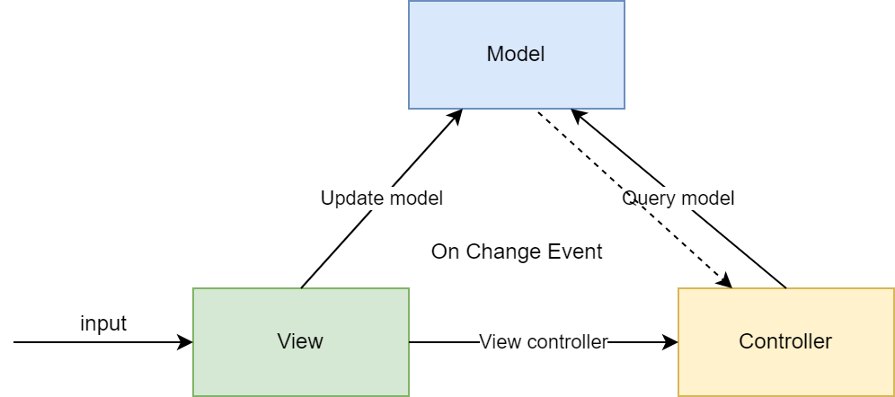

# Software Architecture

### Architectural Pattern
Its a geenral solution for common problem in software engineering field, architectural are like design patterns but have a higher level scope. 
Most commonly found layers in a software architeture are:
1) Presentation 
2) Data
3) Application
4) Business

### Different Patterns:
1) Model View Controller : MVC divides an application into three components: A model, a view, and a controller.

2) Microservices: Microservices pattern involves creating multiple applications—or microservices—that can work interdependently
3) Layered
4) Client Server
5) Broker
6) Event
7) Blackboard
8) Controller-responder

### Different Software Stacks
1) Java
2) LAMP - Linux, Apache, MySQL, PHP
3) MEAN - MongoDB, Express.js, Angular.js, Node.js
4) MERN - MongoDB, Express.js, ReactJs, Node.js 
5) Django 
6) Ruby on Rails
7) Python
8) SMACK - Spark, Mesos, Akka, Casandra, Kafka

### 10 Common Architectural Patterns
- Layered pattern
- Client-server pattern
- Master-slave pattern
- Pipe-filter pattern
- Broker pattern
- Peer-to-peer pattern
- Event-bus pattern
- Model-view-controller pattern
- Blackboard pattern
- Interpreter pattern

### Microservices
Microservices architecture refers to an architectural style for developing appliocations. It allows application to be seperated into smaller parts withc part having its own realm of responsibility. 

